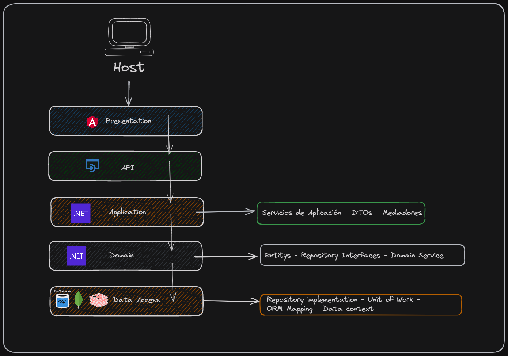

# WebStore

## Overview
WebStore is a application for managing an online store with various types of products. The application has two main views: a customer view and an admin back office.

## Architecture
The application follows a N-layer architecture: 
This architecture was chosen to separate concerns, enhance maintainability, and enable scalability.


## Technologies
- **Backend**: ASP.NET Core, C#
- **Frontend**: Angular, Typescript, Bootstrap, HTML, CSS
- **Database**: SQL Server, MongoDB, Redis
- **Version Control**: Git, GitHub
- **Containerization**: Docker

## Requirements and Functionalities
- User authentication and authorization
- Product management (CRUD operations)
- Shopping cart and order management
- Admin back office for managing products and orders
- Responsive design for various devices

## Setup Instructions
### Prerequisites
- .NET SDK 6.0 or later  [Download and install .NET SDK](https://dotnet.microsoft.com/download)

- Node.js and npm  [Download and install Node.js](https://nodejs.org/)
- Docker [Download and install docker](https://docs.docker.com/get-docker/)
- Git [Download and install Git](https://git-scm.com/downloads)

1. Clone the repository:
    ```bash 
    git clone https://github.com/mario-alexx/web-store-project.git
    cd store-project
    ```

### Running the Project
#### Backend (ASP.NET Core)
1. Navigate to the `TiendaOnline.API` directory:
    ```bash
    cd TiendaOnline.API
    ```

2. Restore .NET dependencies:
   ```bash
    dotnet restore
   ```

3. Run the project:
    ```bash
    dotnet run
    ```

#### Frontend (Angular)
1. Navigate to the `TiendaOnline.Client` directory:
    ```bash
    cd TiendaOnline.Client
    ```
2. Install `npm` dependencies :
    ```bash
    npm install
    ```

3. Run the project:
    ```bash
    ng serve